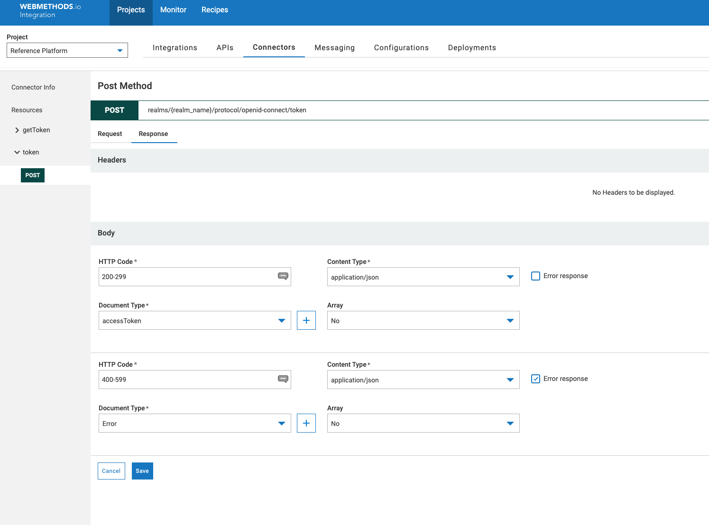

# OAuth Custom Rest Connector 
    This article shows how to create a custom rest connector in webMethods.io to get an access token without using the default OAuth account management and how to configure keycloak server with client_credentials.

# Use-case
If you are integrating with Custom Cloud Rest Application and if the OAUTH Provider for your custom application generates a token with considerably small expiry and there is a need to generate the access token for every session (or service execution) instead of refreshing token on expiry, as refresh on expiry on each new session (service invocation) will be expensive. In such cases, we will need to create a connector or Cloud Integration (Flowservice) to get the access token instead of using the default OAuth Account management of the connector.

As an example, we will use Keycloak as an OAUTH provider to showcase this use case.

# Prerequisite
1. Pre-installed keycloak server. *If you need to create your own instance, you could easily spawn one docker or k8s instance from "keycloak packaged by bitnami". Refer https://bitnami.com/stack/keycloak/helm*

# Topics
1. Creating realm and client in keycloak and configuring them.
2. Test to retrieve token using postman
3. webmethods.IO
   1. Creating custom rest connector & and an account. 
   2. Creating resource & operations for getting token
   3. Creating FlowService to get the token

# Steps

## Creating and configuring realm and client

1. Login to keycloak "Administration console".

2. Login.

3. Create a realm. (name: **test_realm**)

4. Create a client (name: **test_client**), with configs as shown below.

*Note: Select **Use refresh tokens for client credentials grant** in **Open ID Connect Compatibility Modes***
This could be important in some cases, if this is **not** selected *refresh token* will not be sent along with the token response.

## Test to retrieve token using postman

1.  Create a POST request with 4 **form encoded** parameters, *grant_type, scope, client_id, client_secret* and with url *http://<<KEYCLOAK_SERVER>>:<<PORT_NUMBER>>/realms/<<REALM_NAME>>/protocol/openid-connect/token* as below.

    The result will contain token details, like access_token, refresh_token, token expiry, refresh expiry etc. We will use the generated token to access the application resource. 

## webmethods.IO
### Creating custom rest connector

*It’s not mandatory to create a Rest Connector, you could directly use **http** invoke as well. But in general when you have many resources hosted in an application, its better to use Custom Rest Connector, instead of many separate https calls*

1. Create / Open your project in the IO tenant .

2. Navigate to Connectors > Rest and click on **Add Connector**. provide name, URL(http://<KEYCLOAK_SERVER:PORT/>) and select **Credentials** as Authentication Type and save.

3. Navigate to Connectors, select the created connector and click on **Add Account**. Select **Authorization Type** as **none** and rest could be left default.

    *Account could also be created after resources. But we need to have an account created before we create any operation.*

### Creating resource & operation for getting token
1. Click **Add Resource** with name and Path (realms/{real_name}/protocol/openid-connect/token).

    *We have made the **realm_name** as a URL_CONTEXT parameter as this could change depending on the configuration of OAuth Provider.*

2. Add POST as the method and add 5 parameters, out of which 4 of them as FORM_ENCODED for *grant_type, scope, client_id, client_secret* and 1 as URL_CONTEXT for *realm_name*.

3. Navigate to Connectors, select the created connector and click on **Add Account**. Select **Authorization Type** as **none** and the rest could be left default.

4. Add another response body for HTTP range **400-599** for Error, and select the *Error* check box.

5. Navigate to Connectors, hover over the created connector and click **Operations**

6. Click **Add Operation**, provide a name (example: getToken), select the created account and save it.

### Creating FlowService to get the token
We will use the above-created connector and try to retrieve the token in a Flowservice, this step is **not mandatory** for token creation, rather just shows how to retrieve the token. And also it will assist in exporting/importing the whole solution including the connector.

1. Navigate to Integrations > FlowServices and click **+** to add new Flowservice

2. Add a Transform pipeline and add 5 pipeline variables for request parameters.
3. Instead of hardcoding the values, we have defined these in a Reference data and retrieving from there. 

4. Now invoke the operation we created and pass the above stream to the body

5. Save & Test your FlowService

# Downloads / Assets

You could find the export of Flowservice, along with Connector definitions in **assets/integration**.

## How to use/test

1. Login to wM.IO tenant
2. Navigate to project where you want to import
3. Import the zip from assets/integration
4. Add the reference data with name "OAUTH_APP_DEV" and upload the file "OAUTH_APP_DEV.txt" from **assets/reference data**. ***Note: Client Secret needs to be updated accordingly***​​​​​​​
5. Add an account with name "Oauth_None" and details as provided in markdown

______________________
These tools are provided as-is and without warranty or support. They do not constitute part of the Software AG product suite. Users are free to use, fork and modify them, subject to the license agreement. While Software AG welcomes contributions, we cannot guarantee to include every contribution in the master project.	
